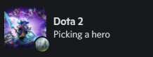
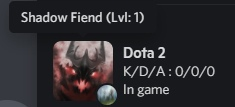

# DotaDiscordExtension

  Discord extension for interacting with dota 2

  

  

# Installation
1) NET 5 SDK (download [here](https://dotnet.microsoft.com/download/dotnet/5.0))
2) Download [release]
3) Open installer.exe

[release]:https://github.com/Fajoo/DotaDiscordExtension/releases/latest
